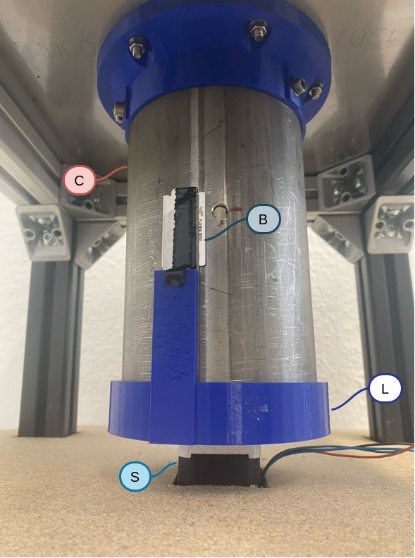

## Contributors
  1. Shohreh Kia

## Motorized Harvesting of Oyster Mushrooms

The above figures show the components used to prototype a pneumatic
harvesting system for Oyster mushrooms.

## Working Principle

The above figure shows the major components of the developed motorized
harvesting system, which consists of a stainless steel cylinder (C)
with fruiting holes suspended from the ceiling of a stool constructed
using item profiles. The cylinder contains a plastic bag filled with a
substrate for oyster mushroom growth. These holes on the cylinder
aligned with the perforation in the plastic bag, allowing the
mushrooms to emerge and grow. A 3D-printed lid (L), matching the
diameter of the cylinder, seals the bottom to prevent substrate
spillage in case of damage to the bag. A stepper motor (S) is
installed underneath the suspended cylinder to drive a 3D-printed
plate, which vertically holds the blade (B).  The plate is
specifically designed to accommodate the motor, ensuring stability
during rotation.

The stepper motor initiates rotation, causing the blade to cut the
mushrooms protruding through the holes in the cylinder. We program the
motor to rotate in either direction to ensure successful
harvesting. Adjustments such as sharpening the knife and modifying the
motor’s speed can be made to optimize the system’s performance.

## Connection Diagram

## CAD Files

The CAD files for the 3D printed components used for this system can be found in 
