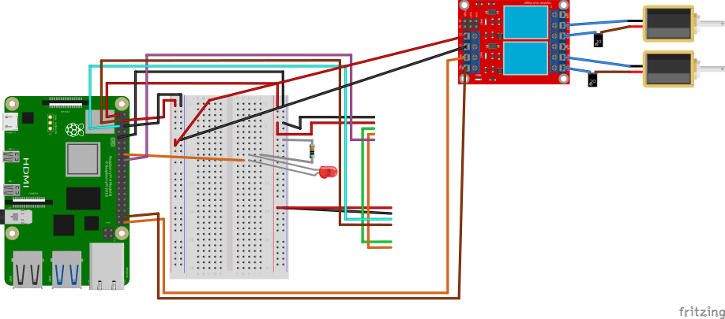

## Contributors
  1. Shohreh Kia
  2. Anant Sujatanagarjuna
  
  
## Pneumatic Harvesting of Oyster Mushrooms

The above figures show the components used to prototype a pneumatic
harvesting system for Oyster mushrooms.

## Working Principle

This system actuates a blade (B) which is mounted perpendicularly on a
bi-directional pneumatic cylinder (C). The cylinder is set up to
harvest oyster mushrooms growing from our developed mushroom pods. The
pneumatic tubes T1 and T2 control the motion of the pneumatic
cylinder. Depending on whether T1 or T2 is pressurized, the piston rod
moves outwards or inwards from the cylinder, respectively. When both
T1 and T2 are pressurized or depressurized, the piston is immobilized
or free to move, respectively.

For the purpose of harvesting, T1 and T2 must be pressurized and
depressurized alternatively. This is accomplished by the 5/3-way
solenoid valve (SV). Internally, two solenoids control the valves
pressurizing T1 and T2. These solenoids are activated by 12-volt DC
magnetic coils MG1 and MG2 . These coils are digitally controlled by
5-volt relay switches connected to a Raspberry Pi 4B, programmatically
controlling the entire setup.

For simplicity, we use a an analog joystick to control the 5-volt
relays, however it is also possible for them to be actuated remotely
and automatically.

## Connection Diagram

The above ciruit diagram was created using
[Fritzing](https://github.com/fritzing/).

`joystick_control.sh` is the accompanying control script.
